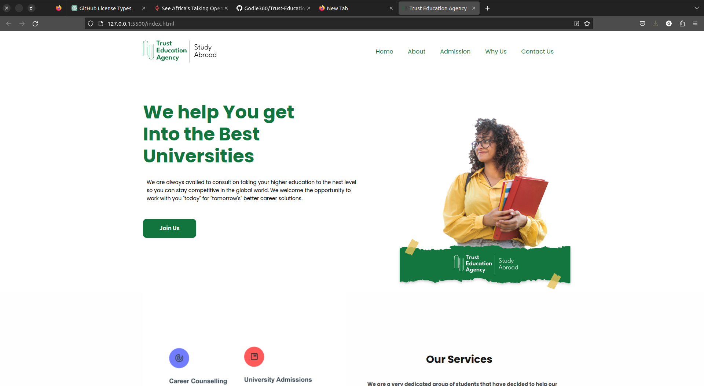
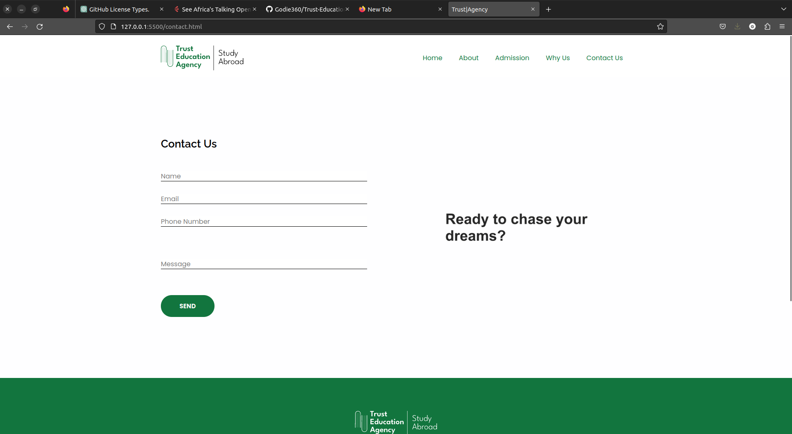

# Trust-Education-Agency-Website

## This website it is responsive as shown in the screenshot i made it for the company called TEA

## License

This project is licensed under the [MIT](https://opensource.org/licenses/MIT) license.

## Contributing

Contributions to the FACE RECOGNITION ATTENDANCE SYSTEM are welcome and encouraged! If you would like to contribute, please fork the repository and submit a pull request.

### Contact

[Email](https://github.com/Godie360) - godfreyenos360@gmail.com

